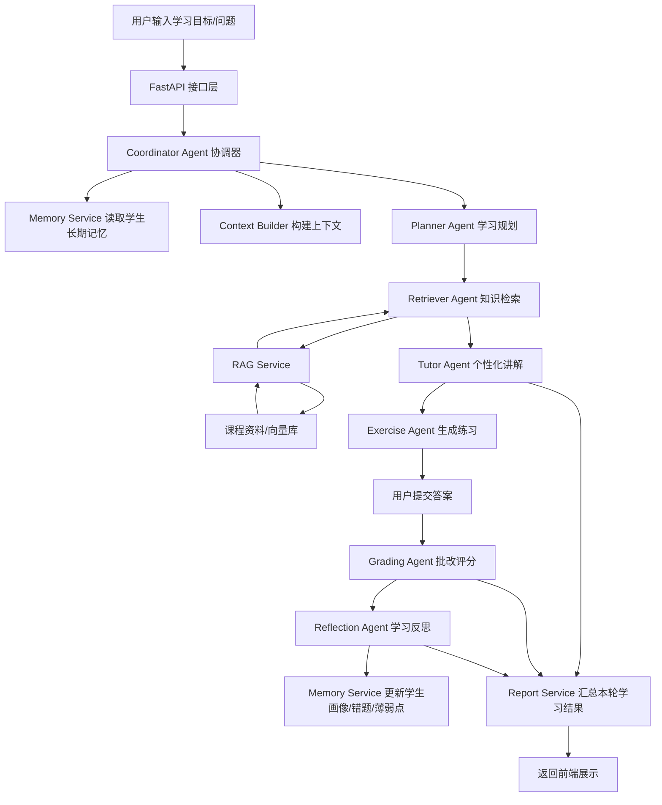
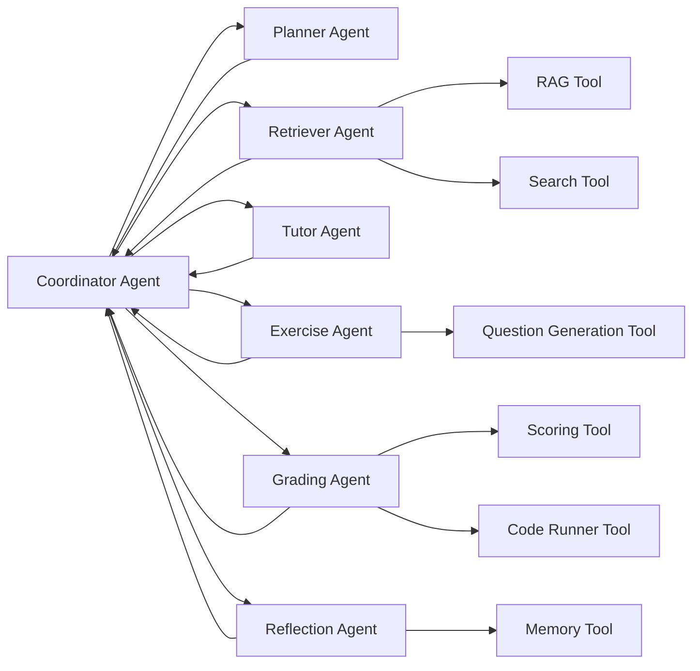

# 从输入到输出的调用逻辑结构图

## 总体调用流程



## 一次学习会话的详细步骤

```text
1. 用户输入
   - 学习目标
   - 当前水平
   - 学习偏好
   - 当前问题

2. API 接收请求
   - 校验 student_id
   - 创建 session_id
   - 保存原始请求日志

3. Coordinator Agent 调度
   - 判断任务类型：问答、学习计划、练习、批改或综合辅导
   - 决定需要调用哪些 Agent

4. Memory Service 读取记忆
   - 学生基础水平
   - 历史薄弱点
   - 已学章节
   - 错题记录
   - 偏好表达风格

5. Retriever Agent + RAG Service
   - 根据问题生成检索 query
   - 从课程资料向量库召回相关片段
   - 去重、排序、压缩上下文
   - 返回 sources 和 evidence

6. Context Builder 组装 Prompt
   - 系统角色
   - 学生画像
   - 当前学习目标
   - 检索资料
   - 历史记忆
   - 输出格式约束

7. Planner Agent
   - 生成阶段学习路径
   - 生成今日任务
   - 判断先学哪些知识点

8. Tutor Agent
   - 基于 RAG 证据进行讲解
   - 根据学生水平调整深度
   - 给出例子和项目建议

9. Exercise Agent
   - 根据当前知识点生成练习
   - 生成评分标准 rubric

10. Grading Agent
    - 用户提交答案后进行批改
    - 输出分数、错误原因、修改建议

11. Reflection Agent
    - 总结学生掌握情况
    - 更新薄弱点和下一步建议

12. Memory Service 写入长期记忆
    - 更新画像
    - 保存错题
    - 保存学习进度
    - 保存本轮摘要

13. API 返回最终结果
    - 个性化回答
    - 学习计划
    - 练习题
    - 引用来源
    - 记忆更新
    - 掌握度评估
```

## Agent 协作结构


