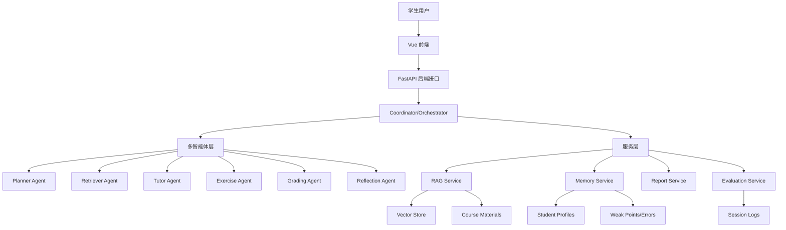

# 系统总体架构

```mermaid
flowchart TB
    U[学生用户] --> FE[Vue 前端]
    FE --> API[FastAPI 后端接口]
    API --> ORCH[Coordinator/Orchestrator]

    ORCH --> AGENTS[多智能体层]
    AGENTS --> A1[Planner Agent]
    AGENTS --> A2[Retriever Agent]
    AGENTS --> A3[Tutor Agent]
    AGENTS --> A4[Exercise Agent]
    AGENTS --> A5[Grading Agent]
    AGENTS --> A6[Reflection Agent]

    ORCH --> SVC[服务层]
    SVC --> RAG[RAG Service]
    SVC --> MEM[Memory Service]
    SVC --> REP[Report Service]
    SVC --> EVA[Evaluation Service]

    RAG --> VS[Vector Store]
    RAG --> CM[Course Materials]
    MEM --> SP[Student Profiles]
    MEM --> WL[Weak Points/Errors]
    EVA --> LOG[Session Logs]
```

## 分层说明

- 前端层：负责用户输入、学习过程展示、练习提交和报告可视化。
- API 层：负责请求校验、会话创建、结果返回。
- 编排层：负责判断任务类型并调度多个 Agent。
- Agent 层：负责规划、检索、讲解、出题、批改、反思。
- 服务层：负责 RAG、记忆、报告、评估等可复用能力。
- 数据层：保存课程资料、向量库、学生画像、提交记录和日志。
